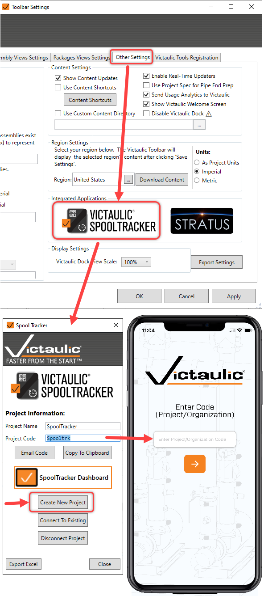
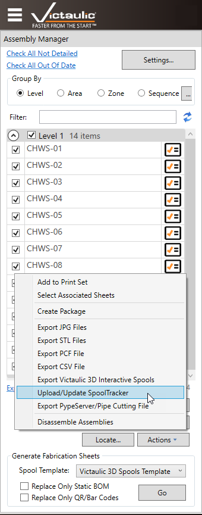
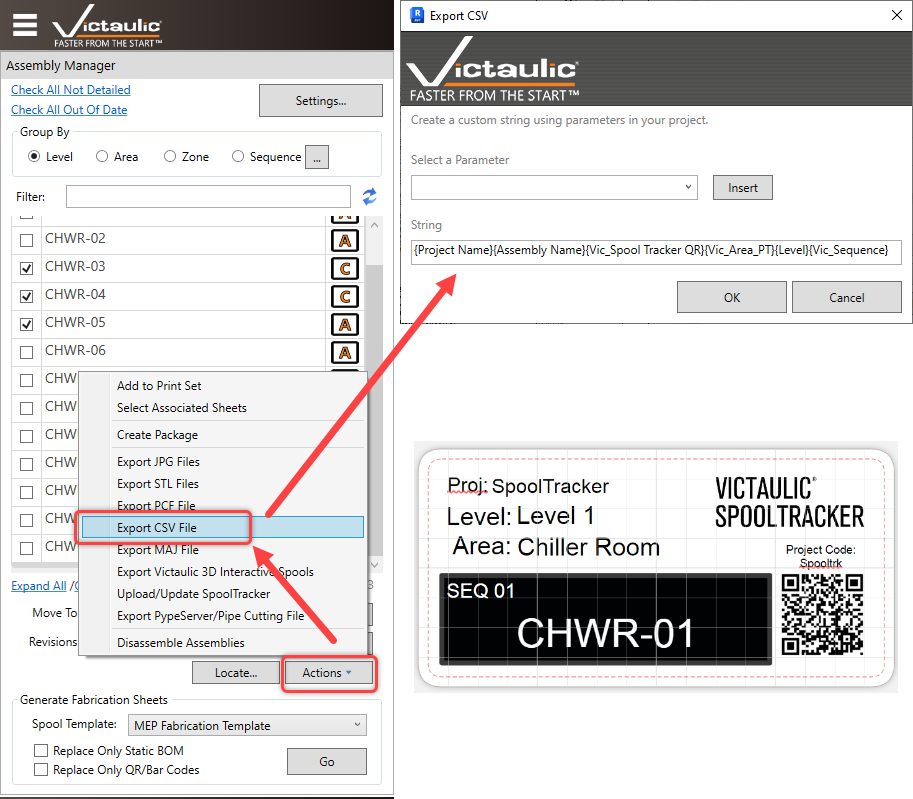

# Victaulic SpoolTracker App Integration

Spools managed by Victaulic Tools for Revit can be tracked from fabrication through installation with the **Victaulic SpoolTracker** app. The user uploading spools needs a SpoolTracker license, available from the [online store](https://www.victaulicsoftware.com/store/victaulic-spooltracker-2023/).

> **Note:** Additional support files can be found at: [https://ws.onehub.com/folders/48hrdhxf](https://ws.onehub.com/folders/48hrdhxf)

## Create a SpoolTracker Project

1. Click the **Spool Tracker** icon located in the **Other Settings** tab of Toolbar Settings.
2. Click **Create New Project**. A Project code is generated.
3. Use this Project code to access the [phone app](../../spooltracker/mobile-app/getting-started.md).



> **Tip:** Alternatively, an **Organization code** can be created by request, and each project can be added via the [web dashboard](https://spooltracker.victaulic.com/).

## Upload Spools

1. Select the spools to upload in the [Assembly Manager](../dock/assembly-manager.md) of the Victaulic Dock.
2. Click **Upload / Update SpoolTracker** in the **Actions** list.



## Label Export

To create labels for spools in the shop, use **Export CSV File** in the **Actions** dropdown of the Assembly Manager. Your label printer can import this file to create all the labels for a package or sequence.



Instead of using a label printer, Avery has a good web label creator at [https://www.avery.com/software/design-and-print/](https://www.avery.com/software/design-and-print/).

- **Avery template:** [http://labe.ls/G77gQcV](http://labe.ls/G77gQcV)

### CSV Export String Sample

```
{Project Name}{Assembly Name}{Vic_Spool Tracker QR}{Vic_Area_PT}{Level}{Vic_Sequence}
```

> **See also:** the [SpoolTracker integration guide](../../spooltracker/vtfr-integration/spooltracker-setup.md) for the SpoolTracker-focused walkthrough.
