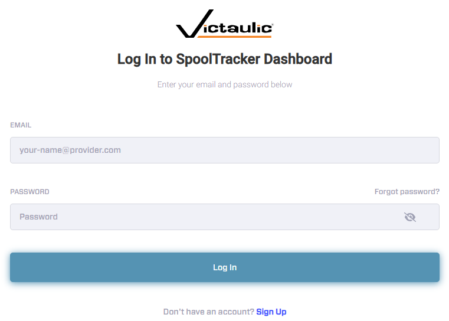
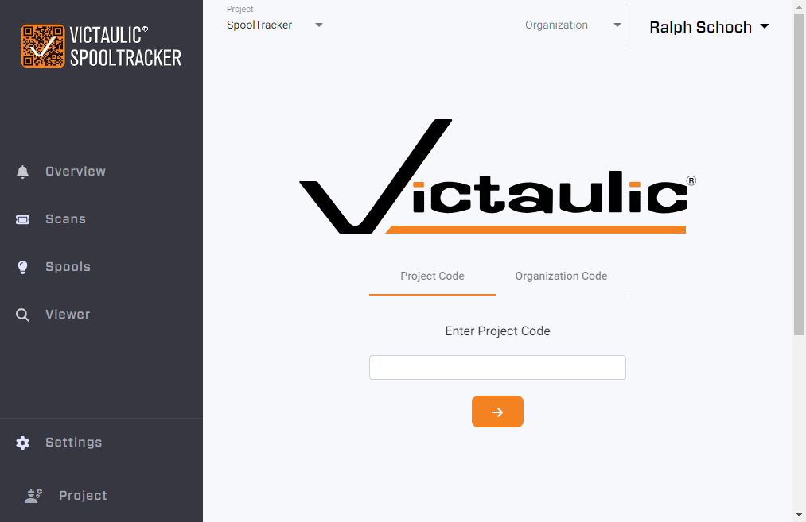
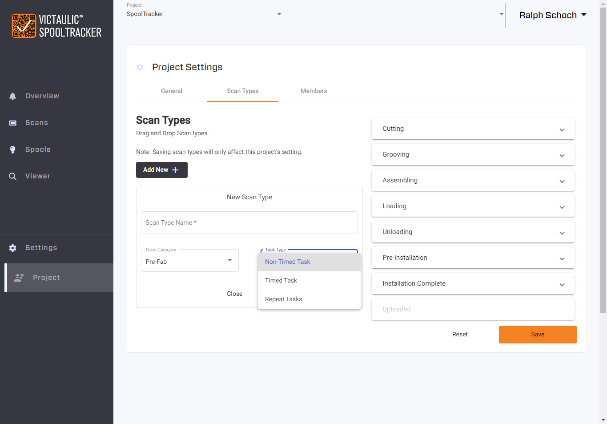
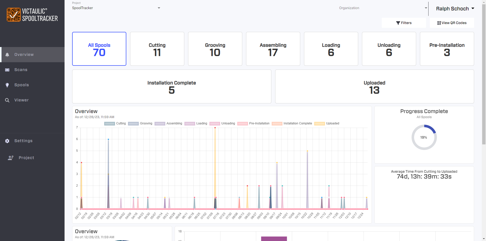
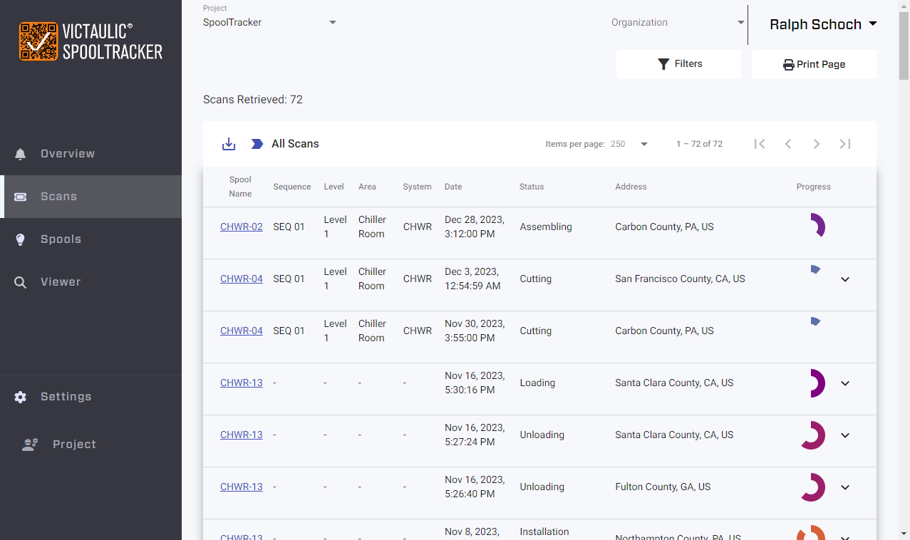

# Victaulic SpoolTracker Dashboard

To visualize the data collected from the SpoolTracker App and administer the project, there is a web dashboard.

> **Note:** SpoolTracker projects can only be created using Victaulic Tools for Revit, and SpoolTracker only works for Revit projects. The creation of Revit assemblies is required to generate the QR codes the app reads.

To access the dashboard, go to [https://spooltracker.victaulic.com/](https://spooltracker.victaulic.com/).

## First-Time Setup

You'll need to create a user account via the website prior to login. Use the **Sign-up** option at the bottom of the login screen if required.

Using the assigned **Project Code** from VTFR will give you access to the project. The first user to log in to the project is elevated to **Admin** and can set up User Access, Organizations, and Scan Types.

Within the **Scans** tab as Admin, you can add, change, and delete scans as needed.

## Project Settings

To customize the tasks tracked in the App, use **Project Settings**. Scan Types can be deleted, added, renamed, and reordered for display by dragging the task in the list.

### Task Types

- **Non-Timed Task** — Can only be assigned one time per spool (One Time Only).
- **Timed Task** — One Time Only, with a timer that displays seconds and minutes.
- **Repeat Tasks** — Use this task as many times as you like per spool (good for QC checks or error tracking).

> **Important:** Don't forget to save your changes when done. For task types, it's best to start small and add more as needed. **Deleting task types that have been used in the app is not supported.** Task types can be unique by Project or Organization.

> **See also:** the [Web Dashboard guides](../../spooltracker/dashboard/getting-started.md) for the full administrator walkthrough.
