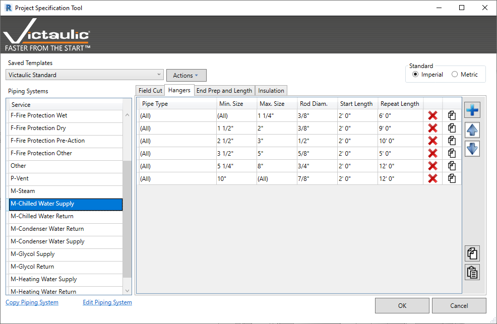
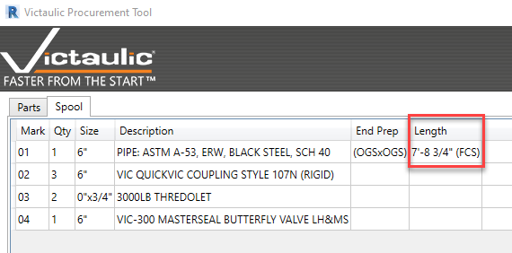
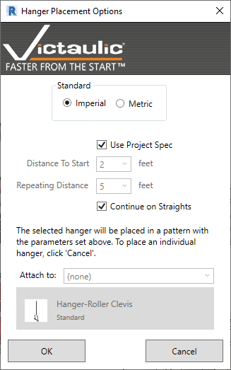
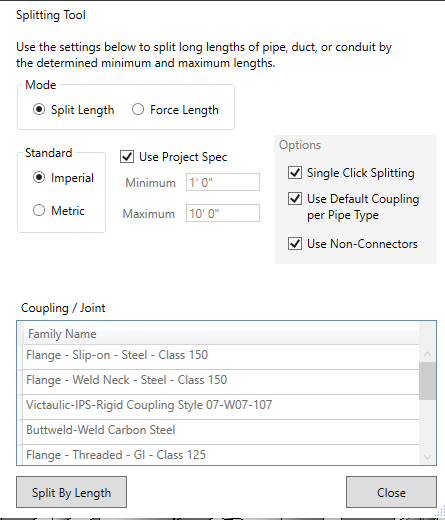

# Project Specification Tool

The **Project Specification** tool is a database-driven tool that lets the user save project-specific information in Revit and recall it to further automate other Victaulic Tools.

The Project Specification tool saves **Field Cut**, **Hanger Placement**, **Pipe Length**, and **Insulation** data as it relates to piping systems and pipe types within Revit. This information can be recalled by familiar tools such as the [Pipe Tools dialog](../pipe-tools/splitting.md), [Hanger Placement Tool](../procurement-and-hangers/fabrication-hangers.md), and Victaulic's insulation tool.

## Field Cut Tab

Specify exact field cut lengths to be added to pipe lengths where the user is unsure about an exact measurement. The [Procurement Tool](../procurement-and-hangers/procurement-tool.md) and [Assembly Manager](../dock/assembly-manager.md) reference this information when generating Bills of Material. Specific rules can be applied to pipe types by size, and extra specified lengths will be added to the Bills of Material.

## Hangers Tab

Captures the **Rod Diameter**, **Start Distance**, and **Repeat Distance** by size. Victaulic's Hanger Placement Tool references this information when placing hangers. The placement tool lets the user switch between pipe from different systems, and customized rules apply while placing hangers.

## End Prep and Length Tab

Stores information about the default Pipe End Prep and the minimum and maximum lengths a pipe can be cut. The Pipe Tools dialog references this information when splitting pipe, and the **Pipe End Prep** parameter can be automatically populated as the user routes pipe.

## Insulation Tab

Keeps information specific to the thickness and material of pipe insulation. Specifying values by Pipe System and by Pipe Type can automate the application of pipe insulation using Victaulic's Insulation Tool, which is found in the **Modify** ribbon.

