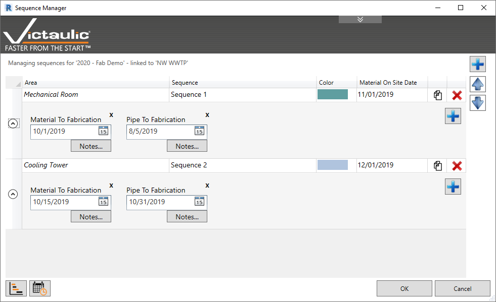
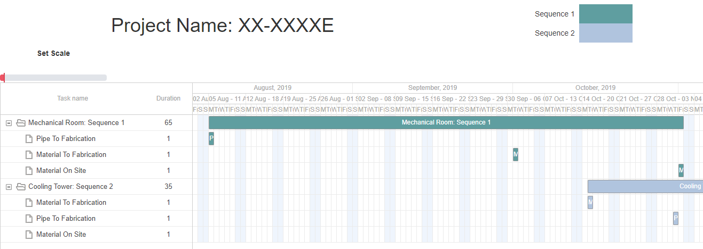
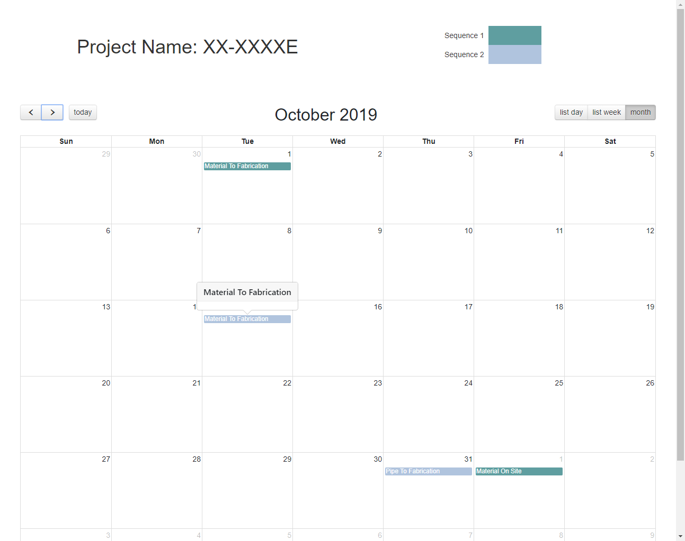

# Sequence Manager

The **Sequence Manager** helps a project manager handle milestone dates for all delivery sequences for a project. The user can create and manage an unlimited number of sequences with customizable dates, assign assemblies to sequences, and print project schedule deliverables.

## Creating a Sequence

Use the **(+)** button to add a sequence, name it, assign it a color, and set a **Material Onsite Date**.

> **Tip:** Use the down arrow to expand the dates section and add additional milestone dates to your sequence.

## Reports

Use the report functionality to quickly print a Gantt chart or calendar view project schedule.

## Assigning Components

Use the [Assembly Manager](../dock/assembly-manager.md) to assign components to a sequence.
