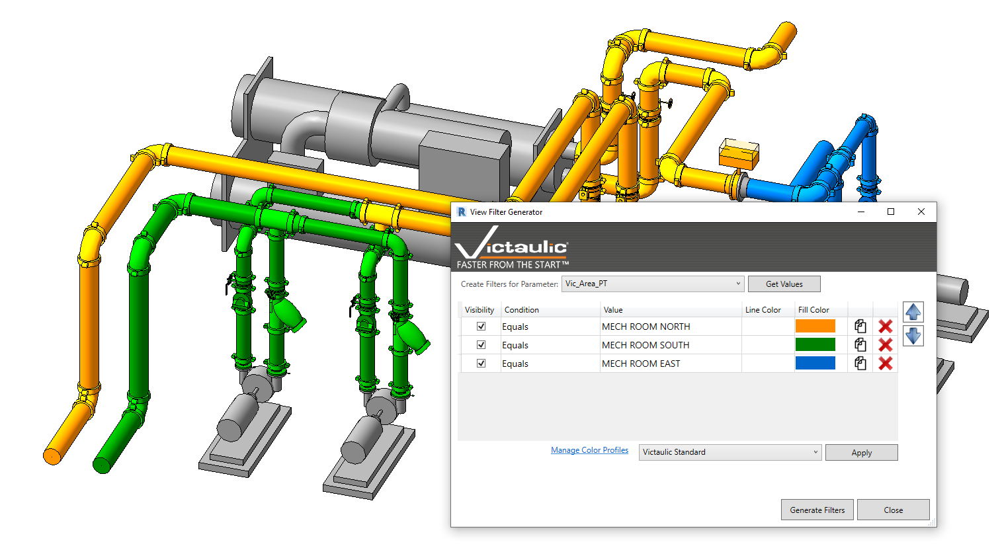

# View Filter Generator

The **View Filter Generator** simplifies the creation of view filters within Revit by allowing the user to query Project Parameters and create view filters based on those unique values.

## Using the Tool

1. Open the tool and select a Project Parameter.
2. Click **Get Values** to see the unique values found in your project.
3. Apply a fill color or line color to each value.
4. Click **Generate Filters**.

> **Tip:** Alternatively, create and manage **Color Profiles** to expedite and standardize the colors chosen for each value.
